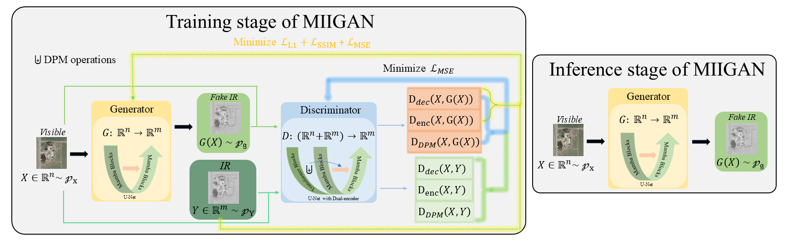
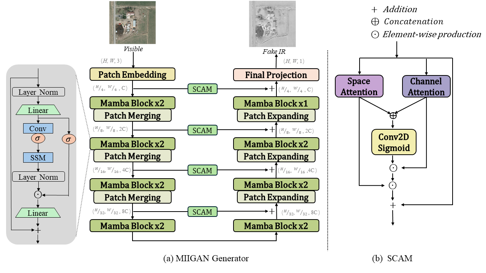
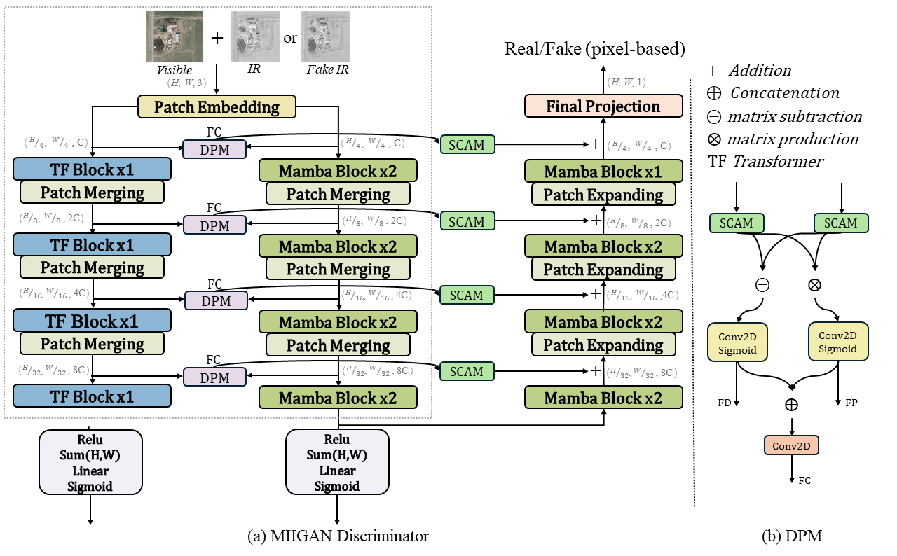
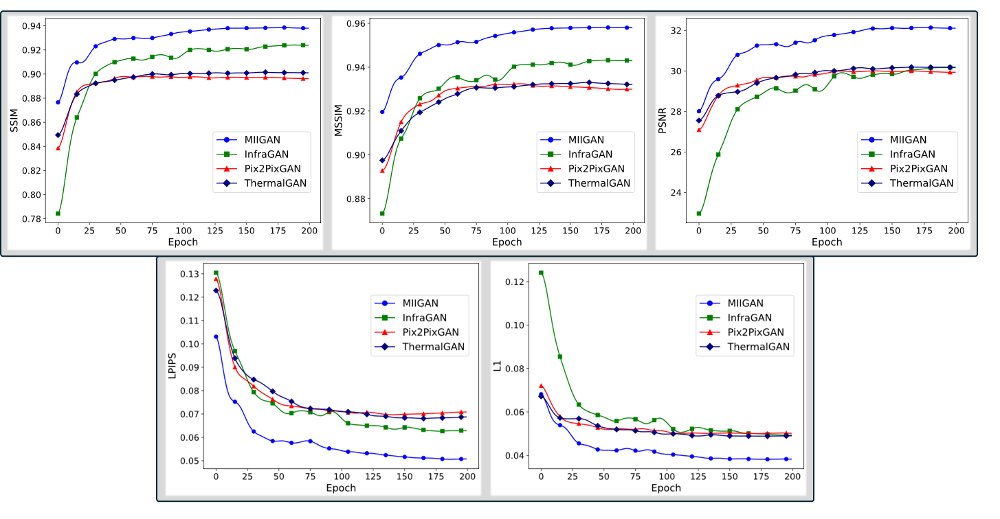

# <h1 align = "center">MIIGAN</h1>

<p align = "center">Fuchao Wang<sup>a</sup>, Huaici Zhao<sup>a,b,*</sup>, Yuhuai Peng<sup>a</sup>, Jian Fang<sup>b,**</sup>, Pengfei Liu<sup>b</sup>, Ronghua Zhang<sup>a</sup></p>

<p align = "center">a.School of Computer Science and Engineering,  Northeastern University, Shenyang, Liaoning, China</p>
<p align = "center">b.Shenyang Institute of Automation, Chinese Academy of Sciences, Shenyang, Liaoning, China</p>

**Abstract** Collecting infrared images on-site is the most direct and realistic approach. However, it is costly, and due to varying environmental conditions, replicating the same conditions for comparative experiments is challenging. This presents significant obstacles for research in infrared technology. To target this issue, we propose MIIGAN, a Visible-to-Infrared Image Generation model that achieves SOTA performance. MIIGAN employs a GAN based on U-Net, with Mamba blocks serving as the core module to improve generation quality. Additionally, we develop a Spatial and Channel Attention Module (SCAM) and integrate it into the skip connections of U-Net to enhance feature extraction. We also design a Dual-encoder combining Transformer and Mamba to improve the discriminator’s performance. Furthermore, we introduce the Difference and Product learning Module (DPM) into the Dual-encoder to enhance differential and consistency feature extraction. Finally, we integrate multi-layer feature differential and consistency losses into the objective function of the discriminator, providing comprehensive pixel-level feedback across multiple scales. We conduct extensive comparative and ablation studies across four datasets and perform downstream object detection tasks on the generated infrared images to validate MIIGAN's performance.

<h2>Architecture</h2>



|  |  |
| ------------------------------------------------------------ | ------------------------------------------------------------ |

<h2>Results</h2>



The code is referenced from InfraGAN [code](https://github.com/makifozkanoglu/InfraGAN).

## Prerequisites
- Linux
- GPU

## Getting Started
### Installation
- Clone this repo:
```bash
git clone https://github.com/wangfc0913/miigan.git
```
- Install dependencies by using the command below
```bash
pip install -r requirements.txt
```
**Note**:  The project uses torch version =2.1.1 and torchvision version =0.16.1 and cu118.

​             Here is the  [reference link](https://github.com/JCruan519/VM-UNet) for Mamba installation.

- Install python libraries [visdom](https://github.com/facebookresearch/visdom) and [dominate](https://github.com/Knio/dominate).
```bash
pip install visdom
pip install dominate
```

visdom is a visualization tool that requires opening an additional terminal and running the command `python -m visdom.server` when using it, and click the URL http://localhost:8097.

### Download datasets

Download  datasets from: Google Drive ([google](https://drive.google.com/file/d/1FXhYbDdqrrHERm8a20drlR18Ylj8iRDY/view?usp=drive_link)) or BaiDuNetdisk([baidu](https://pan.baidu.com/s/1r3h8XDoVDMhiVHeobV7qpg?pwd=zge6))

Place the extracted folder into the project. The project structure is as follows:

```text
- miigan
  -- data
  -- datasets
     --- DroneVehicle
         ---- test
         ---- train
     --- KAIST
         ...
     --- LLVIP
         ...
     --- VEDAI_512
         ...
  -- ...
  -- util
     --- ...
     --- plot.py  # After the training is completed, you can execute this file to compile the results.
```
### Train

```bash
sh train.sh
```
### Test

```bash
sh test.sh
```
### Evaluate

```bash
sh evaluate.sh
```

 # Citation
```

```
